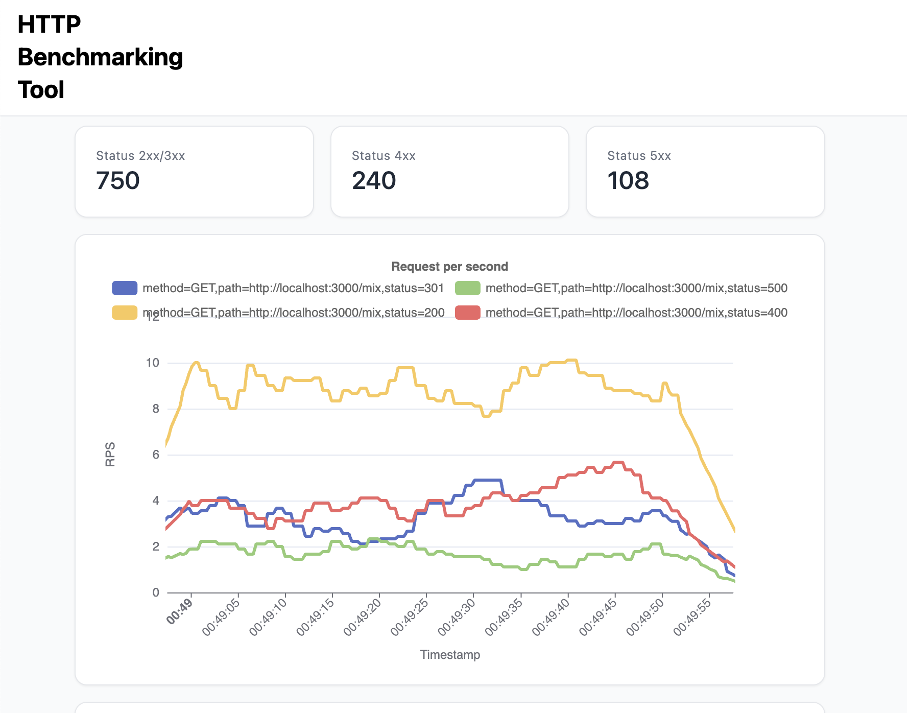

# hb - HTTP Benchmark Tool

hb is a tool for benchmarking HTTP servers. Inspired by oha, wrk, and h2load.


## Getting Started

The hb repository is planned to consist of three tools: client, controller, and dashboard, but currently, only the client is available.

### Client (Under Development)

hb is a relatively simple HTTP benchmarking tool command. Like general HTTP benchmark tools, it sends HTTP requests and measures response time and duration.

```sh
$ hb --duration 10s --clients 10 --thread 4 http://localhost:3000/mix

        Summary │ 2xx|3xx Rate   RPS
 ───────────────┼─────────────────────
                │       71.96%     9


        Counter │ 2xx   3xx   4xx   5xx   Total
 ───────────────┼────────────────────────────────
                │  96    40    35    18     189


       Duration │   Mean      P50      P95      P99      Min      Max
 ───────────────┼──────────────────────────────────────────────────────
                │ 0.542s   0.529s   0.953s   0.991s   0.104s   0.997s


  Response Size │   Mean      Total
 ───────────────┼────────────────────
                │ 79.00B   14.70KiB


          Error │                  Message
 ───────────────┼───────────────────────────
                │ phase: request, count: 4
```

#### Supports OTLP Protocol

As a distinctive feature, it supports the OTLP protocol, allowing metrics to be sent to a specified endpoint. For example, to send metrics to the gRPC endpoint of an otel-collector, use the following command:

```sh
$ hb --otlp-endpoint http://localhost:4317 --otlp-protocol grpc --otlp-interval 1s --duration 10s --clients 10 http://localhost:3000
```

Additionally, since Prometheus v3 has added an endpoint that can receive the otlp protocol, it is also possible to send metrics as follows:

```sh
$ hb --otlp-endpoint http://localhost:9090/api/v1/otlp/v1/metrics --otlp-protocol http-json --otlp-interval 1s --duration 10s --clients 10 http://localhost:3000
```

Sends the following metrics:

- `http_client_request_duration_seconds`
  - Type: Histogram
  - Labels: method, path, status,
- `http_client_response_size_bytes`
  - Type: Histogram
- `http_client_start_time_seconds`
  - Type: Gauge

#### Options

In addition to the above, the following options are available:

```
$ hb --help
Usage: hb [OPTIONS] <URL>

Arguments:
  <URL>
          URL to make the request to

Options:
  -n, --requests <REQUESTS>
          Number of requests to make
  -d, --duration <DURATION>
          Duration of requests to make. Available units: ms, s, m, h, d
  -c, --clients <CLIENTS>
          Number of clients to simulate [default: 10]
  -t, --thread <THREAD>
          Number of native threads to use
      --http-version <HTTP_VERSION>
          If server doesn't address http/2, it will be downgraded to http/1.1 [default: 1.1] [possible values: 1.1, 2]
  -m, --method <METHOD>
          HTTP method to use [default: get] [possible values: get, head, post, put, delete, options, trace, patch]
  -H, --headers <HEADERS>
          Headers to include in the request
      --timeout <TIMEOUT>
          Timeout for the request Available units: ms, s, m, h, d [default: 3s]
  -b, --body <BODY>
          Body of the request
  -B, --body-file <BODY_FILE>
          File containing the body of the request
      --basic-auth <BASIC_AUTH>
          Basic auth in the format username:password
      --otlp-endpoint <OTLP_ENDPOINT>
          OTLP endpoint to send metrics to
      --otlp-protocol <OTLP_PROTOCOL>
          OTLP endpoint to send metrics to [default: http-json] [possible values: grpc, http-binary, http-json]
      --otlp-interval <OTLP_INTERVAL>
          Interval to send metrics to OTLP Available units: ms, s, m, h, d [default: 10s]
      --insecure
          Skip certificate verification
      --disable-keepalive
          Disable keepalive
      --root-cert <ROOT_CERT>
          Root certificate to use
      --resolve <RESOLVE>
          IP address to resolve the hostname to
      --rps <RPS>
          Requests per second Experimental feature: this is not guaranteed to be accurate
  -o, --output <OUTPUT_FORMAT>
          Output format [default: text] [possible values: text, json]
      --no-interactive
          No-interactive mode
      --no-clear-console
          No-clear-console mode
  -h, --help
          Print help
  -V, --version
          Print version
```

#### Installing

Releases are available at https://github.com/watawuwu/hb/releases/latest .

You can install binaries by downloading the release and placing it on your PATH, or else you can use cargo, brew, or shell scripts to install it.

```
$ cargo install --git https://github.com/watawuwu/hb.git hb
```

```
$ brew install watawuwu/tap/hb
```

```
$ curl --proto '=https' --tlsv1.2 -LsSf https://github.com/watawuwu/hb/releases/download/hb-$version/hb-installer.sh | sh
```

#### Container

You can use the container by pulling the image from GitHub Container Registry.
Supported architectures are linux/amd64 and linux/arm64.

[ghcr.io/watawuwu/hb](https://github.com/watawuwu/hb/pkgs/container/hb)

You can also use the container by running the following command.

```
$ docker run -it ghcr.io/watawuwu/hb:latest --help
```

### Dashboard (Under Development)

A dashboard to visualize the results of the HTTP benchmark is planned to be implemented.



### Controller (Under Design)

A custom controller to manage the following custom resource is planned to be implemented using kube-rs.

```yaml
apiVersion: tech.3bi/v1alpha1
kind: HTTPBenchmark
metadata:
  name: test-request
spec:
  url: http://localhost:8080
  method: GET
  duration: 10s
  replicas: 3
```

We plan to focus on improving report visibility and adjusting the start time during parallel execution, comparing only plain job.

## Contributing

Please read [CONTRIBUTING.md](https://gist.github.com/PurpleBooth/b24679402957c63ec426) for details on our code of conduct, and the process for submitting pull requests to us.

## Versioning

We use [SemVer](http://semver.org/) for versioning.

## License

This project is licensed under either of

- Apache License, Version 2.0, (http://www.apache.org/licenses/LICENSE-2.0)
- MIT license (http://opensource.org/licenses/MIT)

at your option.

## Authors

- [Wataru Matsui](watawuwu@3bi.tech)
