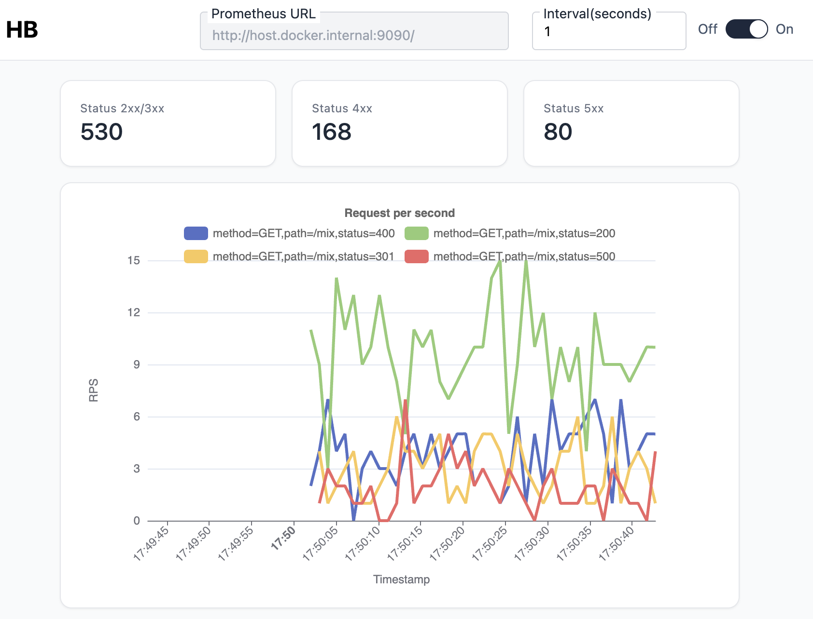

## Simple dashboard for local environment

This directory provides a simple data visualization tool for those who want to check in their local environment or do not have a visualization environment.

This visualization tool will use Prometheus for data storage. You can also use your own Prometheus, but to support OTLP, you need to enable OTLP with the experimental flag or use version 3 or higher.



## Notes && Security

Since the data source can be freely specified from the UI, if it is in Proxy mode, it can access any URL specified from the web server process.
In other words, all users who can view this dashboard will be able to access any URL specified from this process.

This dashboard is intended for use during development or for simple use, so it is not recommended for use in a production environment.
However, if the data source URL is specified with the `--datasource-url` argument or the `HB_DASHBOARD_DATASOURCE_URL` environment variable, it cannot be changed from the UI, so if restrictions are necessary, specify these arguments or environment variables.

## How to run

```bash
$ docker run --rm -it -p 8080:8080 ghcr.io/watawuwu/hb-dashboard
$ open http://localhost:8080
```

```bash
$ docker run --rm -it  ghcr.io/watawuwu/hb-dashboard -h
HTTP Benchmark Tool

Usage: app [OPTIONS]

Options:
  -p, --port <PORT>
          Port to listen on [env: HB_DASHBOARD_PORT=]
  -H, --host <HOST>
          Host to listen on [env: HB_DASHBOARD_HOST=] [default: 0.0.0.0]
  -d, --dist-path <DIST_PATH>
          Path to the dist directory [env: HB_DASHBOARD_DIST_PATH=] [default: frontend/dist]
  -c, --tls-cert-path <TLS_CERT_PATH>
          Path to the TLS certificate file [env: HB_DASHBOARD_TLS_CERT_FILE=]
  -k, --tls-key-path <TLS_KEY_PATH>
          Path to the TLS key file [env: HB_DASHBOARD_TLS_KEY_FILE=]
  -u, --datasource-url <DATASOURCE_URL>
          URL to datasource URL(Prometheus) [env: HB_DASHBOARD_DATASOURCE_URL=]
  -h, --help
          Print help
  -V, --version
          Print version
```
